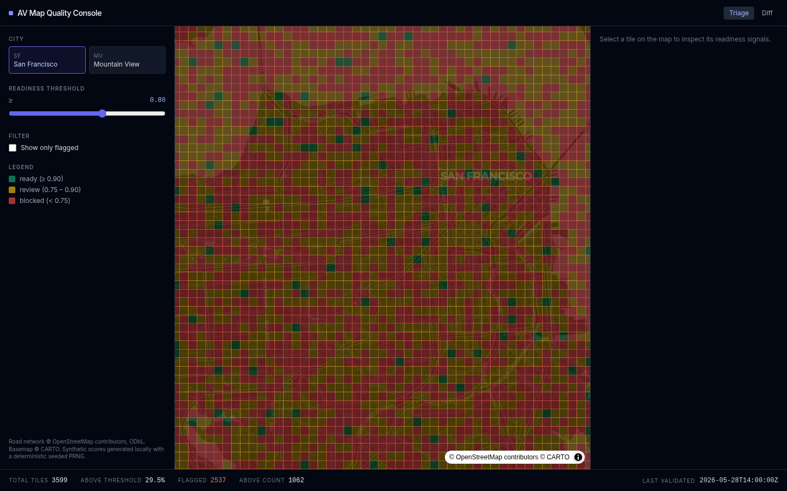
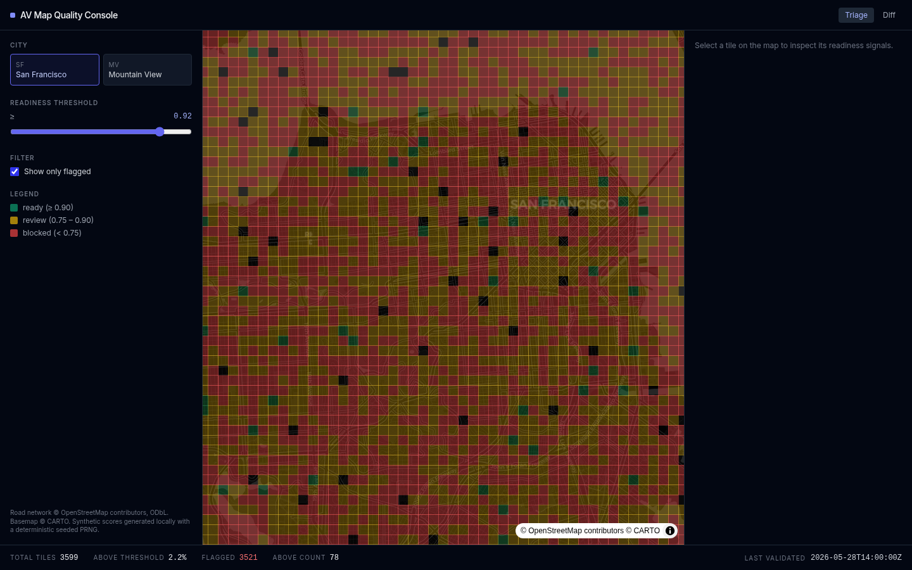
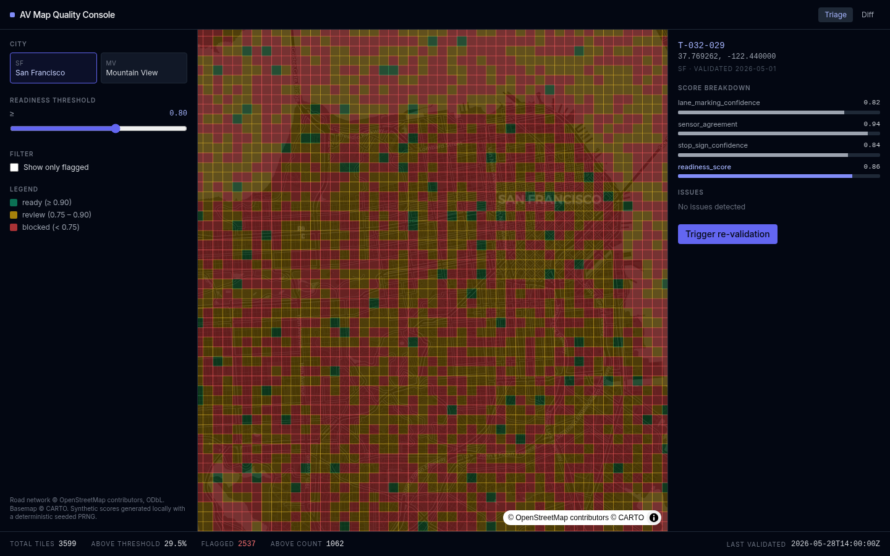
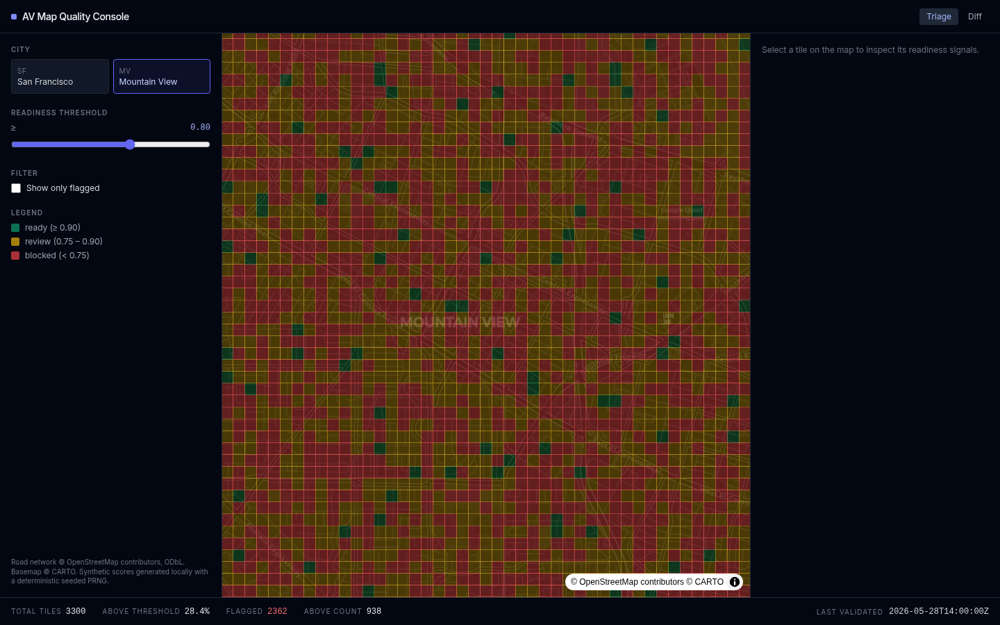
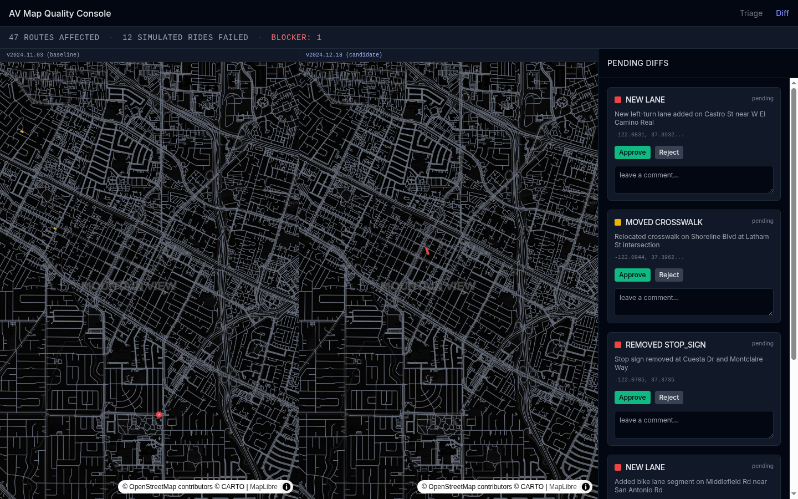

# AV Map Quality & Diff Console

An independent open-source prototype exploring tooling for high-stakes geospatial data quality — the kind of internal console an ops team might use to triage HD-map tiles and review pending edits before they ship to fleet.

Built in a few hours with Next.js + MapLibre on top of real OpenStreetMap extracts. All scores and diffs are synthetic, generated locally from a deterministic seeded PRNG so the views are reproducible without a backend.



## What's in here

Two views, both server-rendered with client-side map interactivity:

**Triage** (`/`) — a tile grid over San Francisco or Mountain View, colored by a deterministic readiness score (`lane_marking_confidence`, `sensor_divergence_score`, `stop_sign_confidence`, `construction_flag`). Adjust the threshold, filter to only flagged tiles, click any tile for a per-signal breakdown.

**Diff** (`/diff`) — side-by-side baseline-vs-candidate map view with a queue of pending changes (new lane, moved crosswalk, removed stop sign, blocker construction). Approve or reject inline with a comment.

## Stack

- Next.js 16 App Router, TypeScript strict
- Tailwind v3, dark theme
- MapLibre GL (no API key — Carto's free dark basemap)
- Real OSM highway extracts for SF and MV bboxes, fetched via Overpass and committed under `public/data/`
- Playwright for headless screenshot capture

## Run it

```bash
npm install
npm run build
npm start                     # http://localhost:3000
```

Regenerate the OSM extracts:

```bash
npm run fetch-data            # writes public/data/{sf,mv}.geojson
```

Capture screenshots (requires a display — use `xvfb-run` on a headless box for WebGL):

```bash
xvfb-run -a -s "-screen 0 1440x900x24" node scripts/screenshots.mjs
```

## Screenshots

| | |
|---|---|
|  |  |
|  |  |

## Data & attribution

Road network © OpenStreetMap contributors, ODbL. Basemap © CARTO. All readiness scores and pending diffs are synthetic, generated locally with a seeded PRNG (`mulberry32` + `fnv1a`) — no real fleet data, no proprietary signals.

## License

MIT.
